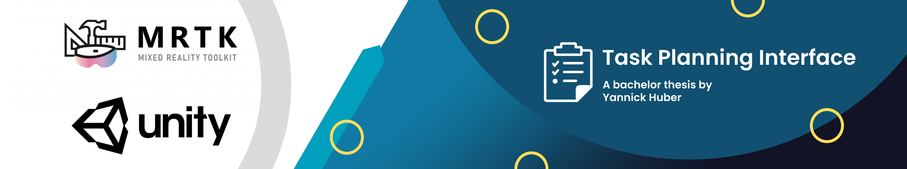
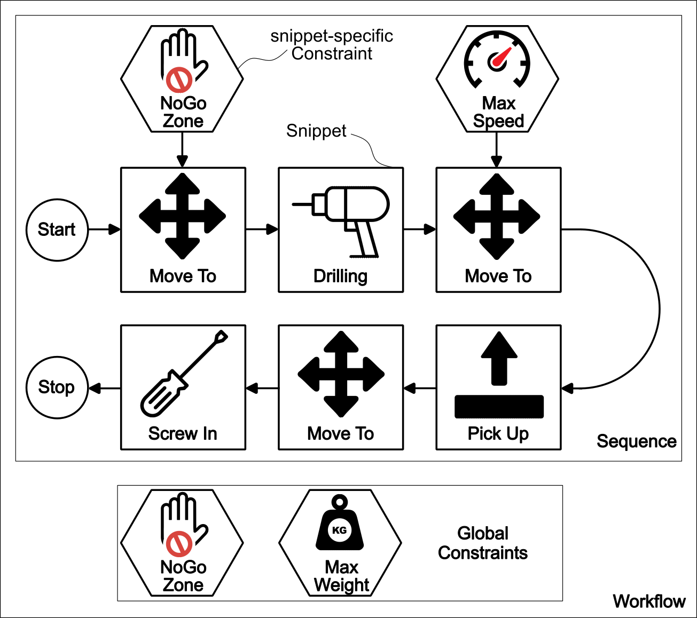

# Task Planning Interface for a Robot Arm in Mixed Reality

Welcome to the **Task Planning Interface (TPI)**, a **bachelor thesis** made by *Yannick Huber*.

## What is the Task Planning Interface?

The Task Planning Interface (TPI), created with the help of the Mixed Reality Toolkit v2.8.3 (MRTK) and Unity3D for the Microsoft HoloLens 2, acts as a framework for the creation of workflows, consisting of machine tasks, lovingly called snippets, and constraints, thus allowing you to define entire processes like the manufacturing of complex parts involving multiple steps before their execution. However, it can also be used with other Mixed Reality glasses supported by the MRTK.

Alongside handling the internal information in the background, the framework also comes with a graphical interface, which allows the operator to access and control the features of the TPI at runtime in the mixed-reality environment.

Furthermore, it allows one to connect to a ROS workstation, control the digital twin of the robot (initially set up for the *FRANKA RESEARCH 3 robotic arm*), create dialog menus, and much more.

This README file is a rough version of the documentation accompanying the bachelor thesis report. The full documentation can be found in the root folder of the project repository.

The Task Planning Interface was developed with the help of the supervisor *Sophokles Ktistakis*, the help of *Accenture* and the help of the *Product Development Group Zurich* (pd|z) in the spring of 2023.

## Installation & Setup

### Required Packages

- The first step in order to successfully use the TPI is to install **MRTK** by following the tutorial found on the following website: [Click Me](https://learn.microsoft.com/en-us/training/modules/learn-mrtk-tutorials/1-3-exercise-configure-unity-for-windows-mixed-reality?ns-enrollment-type=learningpath&ns-enrollment-id=learn.azure.beginner-hololens-2-tutorials). Please keep in mind when selecting a version that v2.8.3 of the MRTK was used when the TPI was designed, whereas MRTK v3.X might not work.

- Afterward, please install the ’ROS-TCP-Connector’ from the ’**Unity Robotics Hub**’ and the ’**URDF Importer**’ as described on this website: [Click Me](https://github.com/Unity-Technologies/Unity-Robotics-Hub/blob/main/tutorials/quick_setup.md).

- Finally, please install the '**2D Sprite**' Unity Package in the ’Package Manager’ of Unity. (Only the ’2D Sprite Package’ of the ’Sprite Editor’ is needed for the TPI, the rest being optional to install.) Window → Package Manager → Select ’Packages: Unity Registry’ instead of ’Packages: in Project’ → Scroll down to ’Packages’ → Install ’2D Sprite’ v1.0.0 (or greater).

Once you have installed those packages, you have successfully prepared the project for the TPI!

### TPI Installation

Now, you can import the files in this project repository into your Unity project's 'Assets' directory.

**NOTE**: The 'Resources/TaskPlanningInterface/UseCases/' folder should contain all the snippet and constraint function GameObjects that are useable in the TPI framework. Please do not put them anywhere else, as the snippet or constraint could otherwise no longer be loaded anymore.

The 'TaskPlanningInterface' folder contains the prefab ’**TPI_Manager**’, which is the essential part of the TPI that holds all the components and GameObjects needed for a successful setup. Drag it into the Hierarchy of your Unity project.

You can also find the prefab '**TPI_DebugTools**', a collection of buttons with predefined functions. Those functions can help you to work with the TPI in the Editor, as the hand menus will not be shown there.

### Setup

In order to configure the TPI, you have the following options:

| Component                      | Description of the Options                                                                                                      |
|--------------------------------|---------------------------------------------------------------------------------------------------------------------------------|
| TPI_DialogMenuController      | Options concerning the dialog menus                                                                                             |
| TPI_HandGestureController     | Options concerning the hand gestures                                                                                            |
| TPI_MainController            | Options concerning the TPI in general and the 'Workflow Hand Menu', i.e., icons and references to the different parts of the TPI |
| TPI_ObjectPlacementController | Options concerning the grid algorithm that strategically places the menus in the environment around the operator |
| TPI_RobotController           | Options concerning the digital twin of the robot                                                                                |
| TPI_ROSController             | Options concerning ROS and the 'ROS Status Menu'                                                                                |
| TPI_SequenceMenuController    | Options concerning the 'Sequence Menu' and the sequence functions (e.g., 'StartSequence()')                                      |
| TPI_TutorialController        | Options concerning the tutorial feature                                                                                         |
| TPI_WorkflowConfigurationController        | Options concerning the 'Sequence Menu' and 'Building Blocks Menu', i.e., categories, snippet options, constraint options |

## How to use the Framework

Once the ’Task Planning Interface’ is started on the mixed-reality glasses (e.g., HoloLens 2), the operator, i.e., the person wearing the head-mounted display (HMD), gains the ability to create a new workflow or load in an already existing one.

A workflow’s main purpose is to manage repetitive processes, allowing the execution of tasks, which occur in a particular order, with certain rules and restrictions multiple times without the need to define it again every time.
Therefore, a workflow can encompass the entirety of a process, like welding a car, consisting of many steps with separate rules. Regarding the TPI, said machine tasks are called snippets, and said restrictions are called constraints.

Afterward, the operator can add new snippets and constraints to the currently opened workflow or manage currently existing snippets or constraints. New snippets and constraints can be created from templates, which were created in the Unity editor and then configured.

How can one designate what is visible in the menus? It can be achieved by following the **summary on how to set up the TPI on the Unity side correctly:**

1. Set up your **categories** and your **snippet and constraint templates** in the 'TPI_WorkflowConfigurationController'
2. Create the **snippet and constraint function scripts** and assign them to your previously created templates
3. **Deploy your project** to the mixed-reality glasses
4. Use the Task Planning Interface to create workflows consisting of your snippets and templates

Please refer to the documentation for an in-depth guide on creating the snippet and constraint function scripts or how to create dialog menus.

## Credits

The lion's share of this framework was written by *Yannick Huber* as a bachelor's thesis at the *Product Development Group Zurich* (pd|z). However, some parts stem from the master's thesis 'Human-Robot Object Handovers using Mixed Reality' by *Manuel Koch*.

## Known Bugs

- Depending on the MRTK configuration and the HoloLens, hand gesture recognition seems to have problems. It mostly works, if the hand gesture verification amount in the Unity inspector is set to 1. However, even though it seems to work in the Unity environment, the other cases with a verification amount of more than one do not work on the HoloLens. Furthermore, the HoloLens seems to have problems detecting the palm area of the hands, leading to problems with the gesture visualization (text containing the name). 